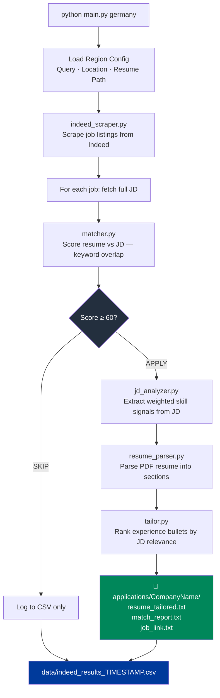

<div align="center">

# 🤖 Job Apply Engine

### Automated job hunting — scrape, score, tailor, apply

[](https://python.org)
[](.)
[](.)
[](.)
[](.)

<br/>

```
python main.py germany
      │
      ├── Scrapes Indeed → 50+ jobs
      ├── Parses your resume (PDF)
      ├── Scores each job (0–100)
      ├── Tailors resume bullets to JD
      └── Saves match reports per company
```

</div>

---

## 🎯 What Is This?

**Job Apply Engine** is a CLI-driven job application automation tool. You run one command, it scrapes job listings from Indeed, scores each job against your resume, and for every role above a 60% match — it auto-tailors your resume bullet points to the job description and saves a per-company application folder.

Built for risk/GRC/data professionals targeting Germany and India markets.

---

## 🔁 How It Works



---

## 📁 Output Structure

For every **APPLY** decision, the engine creates:

```
applications/
└── Amazon_Web_Services/
    ├── resume_tailored.txt    # Top 8 resume bullets ranked by JD match
    ├── match_report.txt       # Matched skills with weights
    └── job_link.txt           # Direct link to the job posting

data/
└── indeed_results_20260201_210827.csv   # All jobs: company, title, score, decision
```

---

## ⚙️ Engine Modules

<table>
<tr>
<td width="50%">

**`engine/indeed_scraper.py`**
> Scrapes Indeed job listings by query + location. Fetches full job descriptions via BeautifulSoup. Paginates across multiple result pages.

**`engine/matcher.py`**
> Extracts text from your PDF resume using pdfplumber. Computes keyword overlap score (0–100) between resume and job description.

**`engine/jd_analyzer.py`**
> Scans JD text against a weighted skill map. Returns a ranked dict of matched skills — heavier weights for high-value terms like `iso 27001`, `grc`, `risk governance`.

</td>
<td width="50%">

**`engine/resume_parser.py`**
> Parses your PDF resume into sections (experience, skills, etc.), filtering out contact/header noise.

**`engine/tailor.py`**
> Scores each experience bullet point against the JD signal. Returns the top-ranked bullets — the ones most likely to get past ATS.

**`engine/skill_map.py`**
> Weighted skill dictionary. Risk/GRC terms score 3x, technical tools score 2x, soft skills score 1x. Easy to extend.

</td>
</tr>
</table>

---

## 🌍 Multi-Region Support

```python
# config/germany.py
QUERY = "Risk Analyst"
LOCATION = "Germany"
RESUME_PATH = "resumes/Jeevan_Resume.pdf"

# config/india.py
QUERY = "Risk Operations"
LOCATION = "India"
RESUME_PATH = "resumes/Jeevan_Resume.pdf"
```

```bash
python main.py germany   # Targets de.indeed.com
python main.py india     # Targets in.indeed.com
```

---

## 📊 Skill Weight Map

| Weight | Skills |
|:---:|:---|
| **3 (High)** | Risk Governance, ISO 27001, ISO 31000, PCI DSS, SOX ITGC, GDPR, GRC, Incident Response, Data Security |
| **2 (Medium)** | SQL, Python, Power BI, Tableau, Forecasting, Risk Scoring, Program Management |
| **1 (Standard)** | Stakeholder Management, Process Optimization |

> The skill map is in `engine/skill_map.py` — extend it for any domain.

---

## 🚀 Setup & Run

```bash
git clone https://github.com/Jeevan-0508/job-apply-engine.git
cd job-apply-engine

python -m venv venv
venv\Scripts\activate
pip install -r requirements.txt

# Add your resume
cp your_resume.pdf resumes/Jeevan_Resume.pdf

# Run for a region
python main.py germany
python main.py india
```

---

## 📦 Project Structure

```
job-apply-engine/
├── main.py                  # Entry point — orchestrates full pipeline
├── requirements.txt
├── config/
│   ├── germany.py           # Query, location, resume path
│   └── india.py
├── engine/
│   ├── indeed_scraper.py    # Scrape + fetch JDs
│   ├── matcher.py           # Resume vs JD score (0–100)
│   ├── jd_analyzer.py       # Weighted skill extraction
│   ├── resume_parser.py     # PDF resume → sections
│   ├── tailor.py            # Rank bullets by relevance
│   └── skill_map.py         # Weighted skill dictionary
├── resumes/
│   └── Jeevan_Resume.pdf
├── data/                    # CSV output (gitignored)
└── applications/            # Per-company folders (gitignored)
```

---

## 💡 Skills Demonstrated

| Skill | Detail |
|:---|:---|
| 🕷️ **Web Scraping** | BeautifulSoup + requests, pagination, dynamic content handling |
| 📄 **PDF Parsing** | pdfplumber resume extraction, section detection, noise filtering |
| 🧠 **NLP (Lightweight)** | Keyword extraction, weighted scoring, relevance ranking |
| 🏗️ **Pipeline Architecture** | Modular engine design — each component independently testable |
| 🌍 **Multi-Region Config** | Region-aware execution with config-driven parameters |
| 📊 **Data Output** | Pandas CSV export, per-company folder generation |

---

<div align="center">

**Built by [Jeevan Kumar](https://github.com/Jeevan-0508)**

*Stop applying manually. Let the engine do it.*

</div>
